# OS Coursework Journal

NAME : ASHIKHA AMBALATHUVEETTIL ASHRAF

MODULE : OPERATING SYSTEMS

VIRTUALISATION PLATFORM: VIRTUALBOX  

GUEST OS: Ubuntu Server 24.04 LTS  

---

WEEK 1: VIRTUAL MACHINE SETUP

OBJECTIVE:

To install and configure an Ubuntu Server virtual machine using VirtualBox.

TASKS COMPLETED:

- Installed VirtualBox on host system
- Downloaded Ubuntu Server 24.04 LTS ISO
- Created a new virtual machine
- Allocated CPU, RAM, and storage
- Installed Ubuntu Server successfully

EVIDENCE:

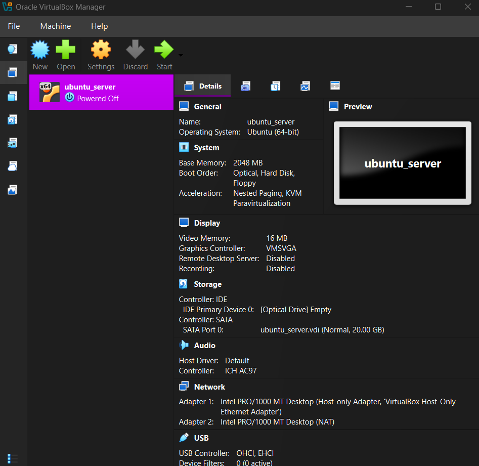

OUTCOME:

Ubuntu Server was installed and booted successfully.

---

WEEK 2: NETWORK CONFIGURATION

OBJECTIVE:

To configure and verify network connectivity.

TASKS COMPLETED:

- Configured Host-Only and NAT adapters
- Verified IP addresses using `ip addr`
- Tested connectivity using `ping`
- Verified SSH access from host machine

EVIDENCE:

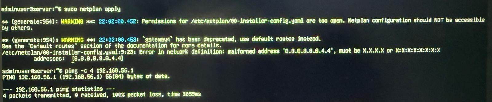
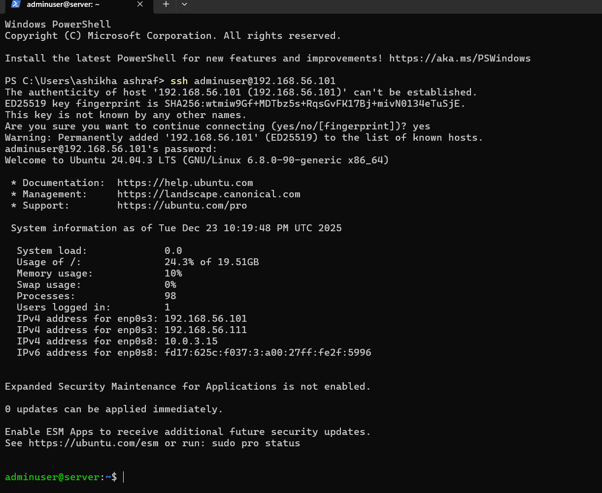

OUTCOME:

Network connectivity was successfully established.

---

WEEK 3: SSH AND SECURITY CONFIGURATION

OBJECTIVE:

To configure secure remote access to the Ubuntu Server using SSH.

TASKS COMPLETED:

- Installed and enabled OpenSSH server
- Verified SSH service status
- Connected to server using SSH from host machine
- Configured key-based authentication
- Tested password-based authentication

EVIDENCE:

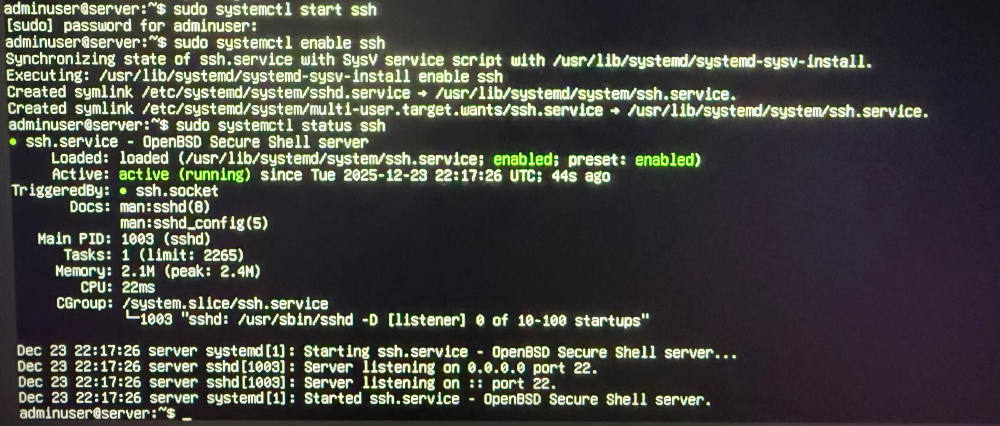
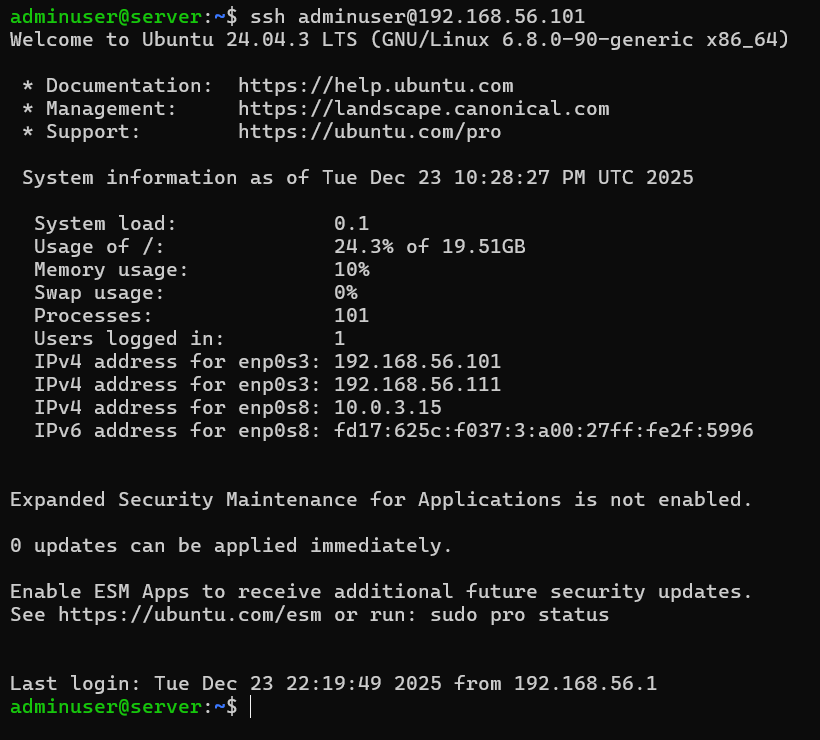
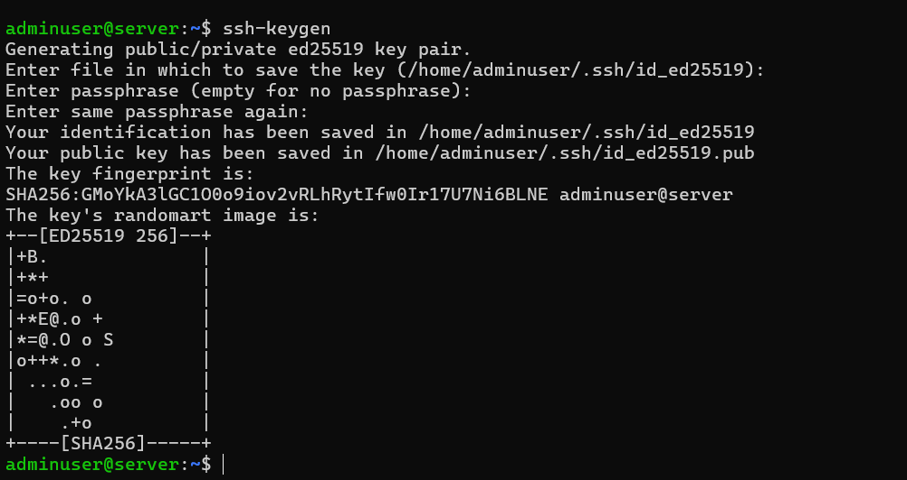
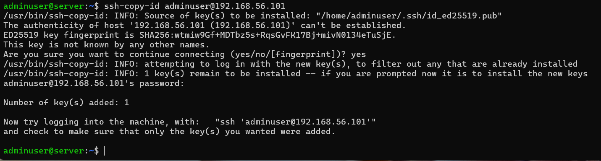

OUTCOME:

Secure remote access to the server was successfully configured.

---

WEEK 4: FIREWALL CONFIGURATION

OBJECTIVE:

To configure a firewall to protect the server.

TASKS COMPLETED:

- Enabled UFW firewall
- Allowed SSH traffic through firewall
- Verified firewall status

EVIDENCE:

OUTCOME:

Firewall rules were successfully applied to secure the server.

---

WEEK 5: PERFORMANCE TESTING

OBJECTIVE:

To evaluate system and network performance.

TASKS COMPLETED:

- Installed performance tools (iperf3, fio, memtester)
- Conducted CPU and memory tests
- Conducted disk I/O tests
- Conducted network performance tests

EVIDENCE:

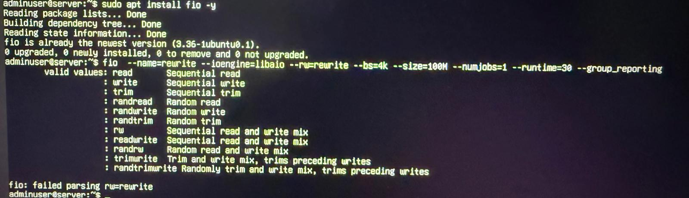
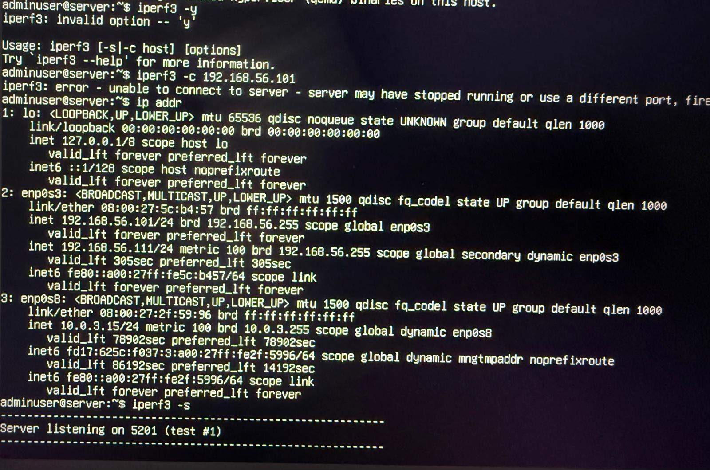
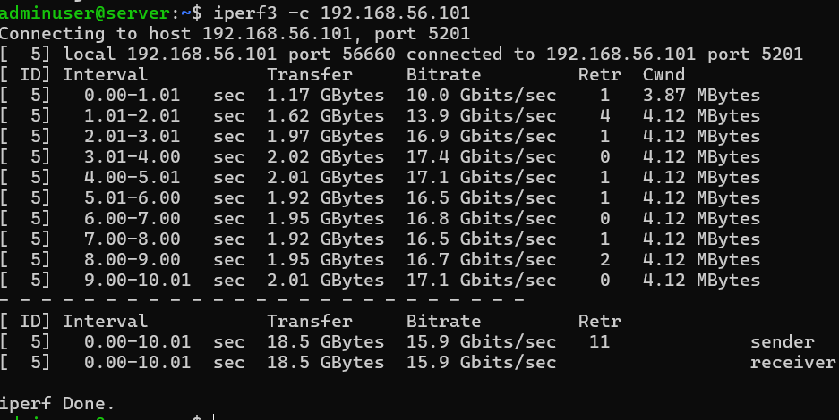
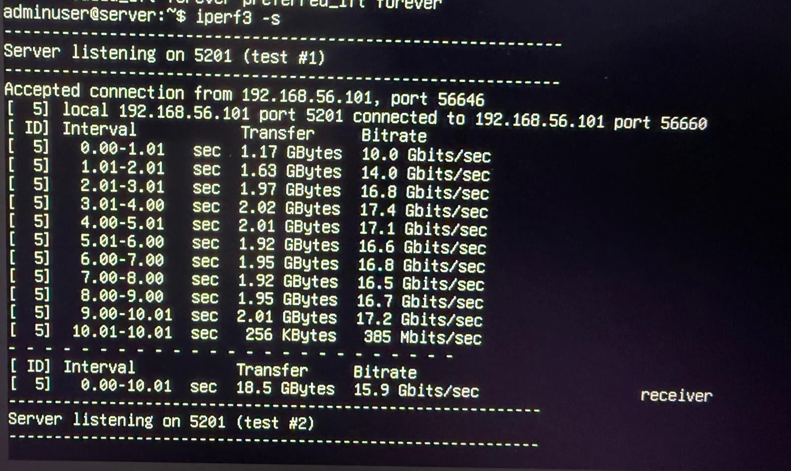

OUTCOME:

System performance was tested and results were recorded.

---

WEEK 6: SYSTEM MONITORING

OBJECTIVE:

To monitor system resource usage.

TASKS COMPLETED:

- Used monitoring tools (top, htop, iostat)
- Observed CPU, memory, and disk usage during tests

EVIDENCE:

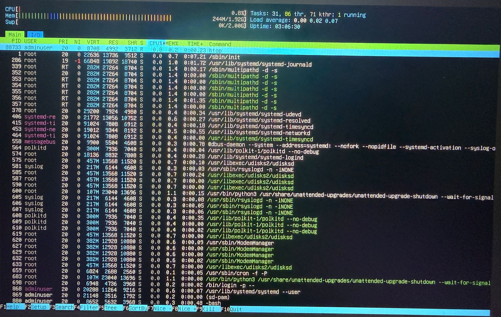
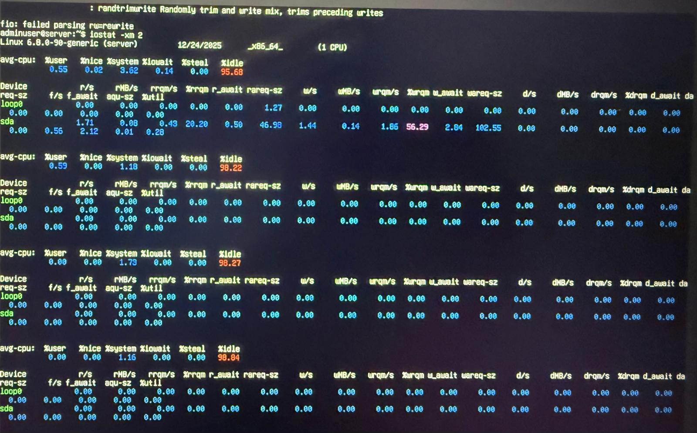

OUTCOME:

System performance was successfully monitored in real time.

---

WEEK 7: SECURITY AUDIT AND SYSTEM EVALUATION

OBJECTIVE:

To perform a comprehensive security audit of the Ubuntu Server system, evaluate its overall security posture, and verify that all previously implemented security controls are functioning as intended.

TASKS COMPLETED:

-Installed and executed Lynis to conduct a full system security audit
-Analysed the Lynis hardening index, warnings, and security recommendations
-Performed a network security scan using nmap within the isolated VirtualBox environment
-Reviewed all running system services to ensure only essential services were enabled
-Verified firewall rules and SSH access restrictions

EVIDENCE:

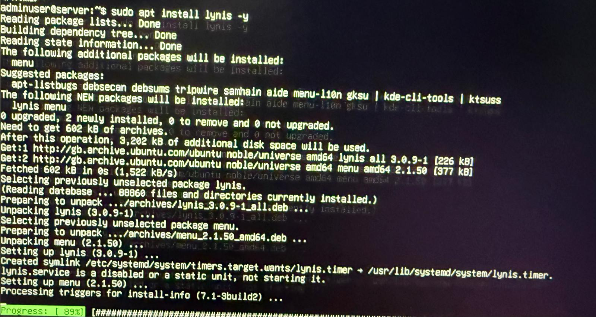
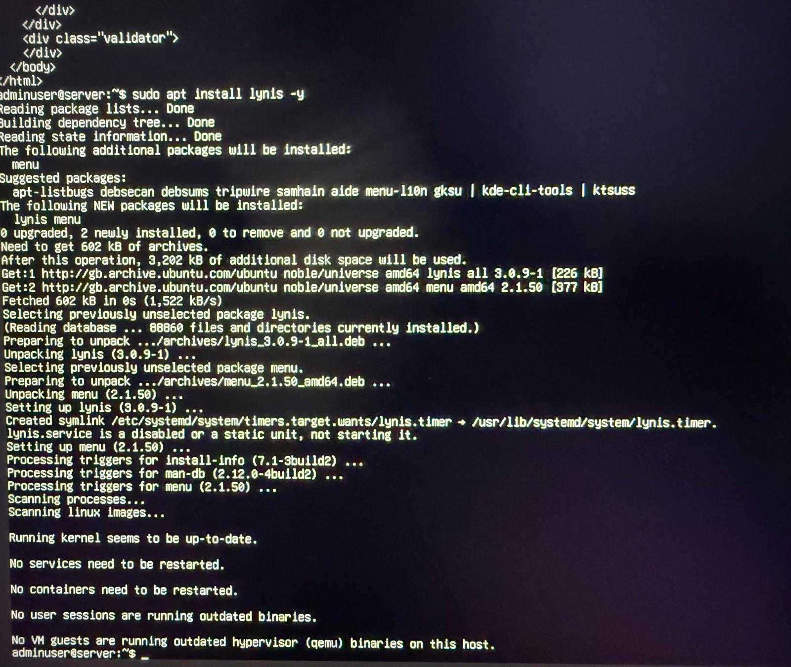
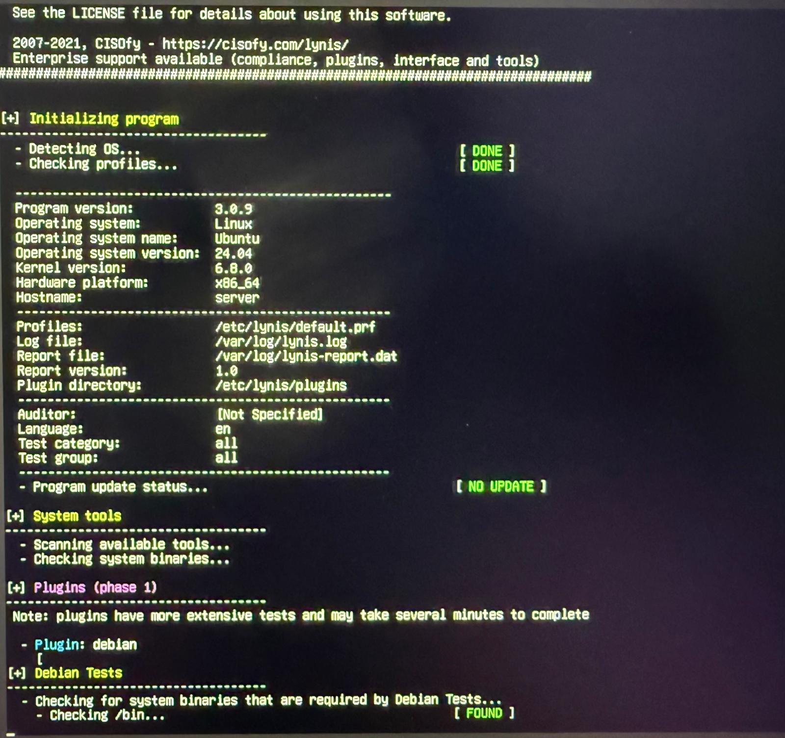

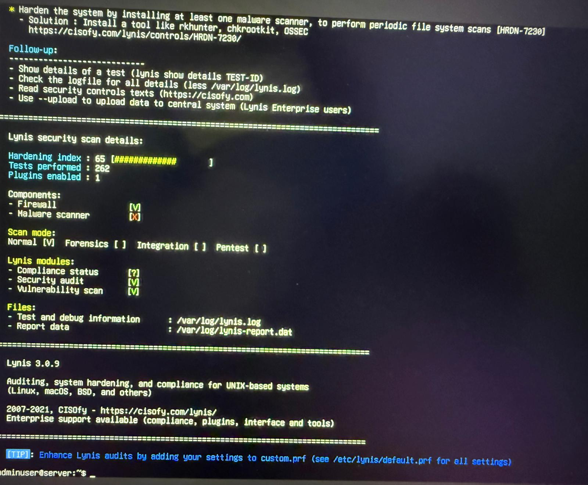
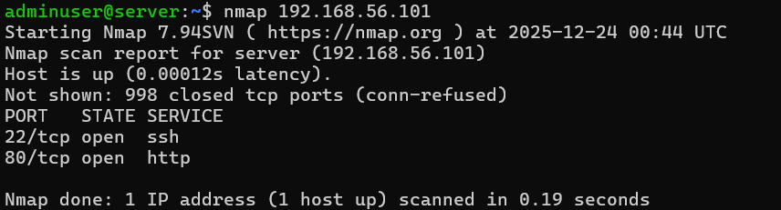

OUTCOME:

The security audit confirmed that the Ubuntu Server system is well-hardened and securely configured. The Lynis audit demonstrated a strong security posture with most recommended controls already implemented. The nmap scan verified that only SSH (port 22) was accessible, significantly reducing the attack surface. The service audit confirmed that only essential services were running, minimising unnecessary security risks. Overall, the system meets best-practice standards for secure remote server administration.

